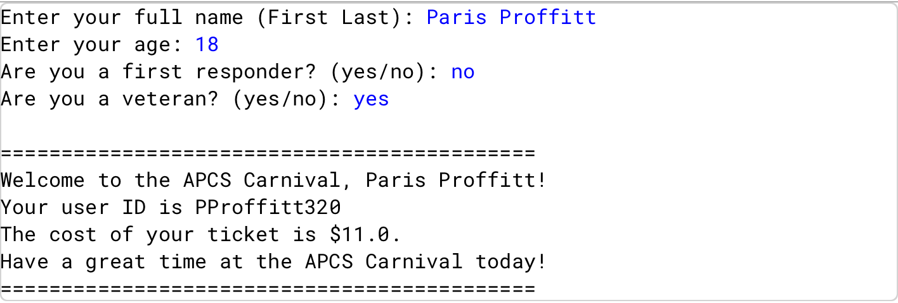

# Welcome to the Carnival

## Description
This project is part of my AP Computer Science A coursework.  
It is a Java program that simulates a carnival ticket purchasing platform. The program calculates ticket prices based on age and eligibility for discounts, generates a unique user ID, and prints a personalized ticket for the user.

## Features
- Prompts the user to enter their full name, age, and answer questions about first responder or veteran status.
- Calculates ticket price based on age and applies discounts if eligible.
- Generates a unique user ID using the first initial, last name, and a random number.
- Displays a personalized carnival ticket with all relevant information.

## Skills 
- Collecting and parsing user input in Java.
- Using conditional statements for decision-making and applying discounts.
- String manipulation to create user IDs.
- Formatting output for a clear, user-friendly display.

## How to Run
1. Open the project in **BlueJ**.
2. Compile all classes.
3. Run the main class (`CarnivalTicketREDONE`).
4. Enter your full name, age, and answer the prompts when requested.
5. The program will calculate your ticket price, generate a user ID, and print your carnival ticket.

## Sample Output

## Notes
- This project was completed using **BlueJ**.
- All source code is written in **Java**.
